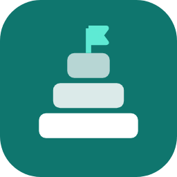

<p align="center"></p>

# Babel

**Todas las misiones, todos los idiomas.**

Traduce los libros de misiones de tus modpacks de Minecraft al español (o a otros ~28 idiomas) con un par de clics. Sin instalar mods: el texto queda traducido directamente en el modpack.

## Qué hace

- Encuentra solo las misiones del modpack que elijas y las traduce.
- Protege lo que no debe tocarse: identificadores, dependencias entre misiones, nombres de objetos, códigos de color y enlaces.
- Instala la traducción en el modpack y guarda el archivo original como `.respaldo`.
- Recuerda lo que ya tradujo, así que volver a correrla es casi instantáneo y no gasta cuota.
- Si parte del texto vive dentro de un mod (`.jar`), crea y activa un paquete de recursos con la traducción.

## Compatibilidad

| Sistema de misiones | Versiones típicas | Estado |
|---|---|---|
| FTB Quests | 1.16.5 en adelante | ✅ Probado |
| Better Questing | 1.7.10 / 1.12.2 | ✅ Soportado |
| Heracles / Odyssey Quests | 1.19 / 1.20 | 🧪 Experimental |
| FTB Quests antiguo | 1.12.2 | ❔ Puede funcionar |
| Logros personalizados (Triumph, p. ej. SkyFactory 4) | 1.12.2 | ❌ No soportado |

Funciona igual con Forge, NeoForge, Fabric y Quilt. Probado principalmente con modpacks de CurseForge.

## Descarga y uso

1. Ve a **[Releases](../../releases)** y descarga `Babel_portable.zip`.
2. Descomprímelo donde quieras (no necesita instalación).
3. Abre `Babel.exe`.
4. Elige la carpeta del modpack:
   - En CurseForge, haz clic derecho en el modpack → **Open Folder** (Abrir carpeta).
   - En la ventana que se abre, haz clic en la barra de direcciones de arriba y copia la ruta (Ctrl+C).
   - Pégala en el campo **Carpeta del modpack** de Babel (Ctrl+V). También puedes pulsar **Examinar** y buscar la carpeta.
5. Elige el idioma y pulsa **Traducir**.

Cierra el juego antes de traducir. Al terminar, abre el juego y listo.

## Motores de traducción

La app usa el primero que esté disponible:

1. **DeepL** (recomendado, la mejor calidad). Crea una cuenta gratis en [deepl.com/pro-api](https://www.deepl.com/pro-api) y pega tu clave. Da 500 000 caracteres al mes.
2. **LibreTranslate** (opcional, en tu PC, sin límites). Ver abajo.
3. **Google Translate** (sin configurar nada). Alcanza para uno o dos modpacks; si traduces muchos seguidos, Google puede bloquearte por unas horas.

### LibreTranslate en tu computadora (opcional)

Necesitas [Python](https://www.python.org/downloads/) instalado. En una terminal:

```
pip install libretranslate
libretranslate --load-only en,es --threads 12
```

Deja esa ventana abierta mientras traduces. `--threads` es cuántos hilos del procesador usa; ajústalo a tu equipo.

## Dónde guarda las cosas

Todo queda en `Documentos\Babel` (si usabas una versión anterior, tu carpeta `FTB_Translator` se mueve ahí sola):

- `memoria_traducciones.json`: traducciones ya hechas. Bórralo si quieres retraducir todo desde cero.
- `config.json`: tus preferencias y, si lo marcaste, tu clave de DeepL.
- `_traducido`: copia de todos los archivos traducidos.

### Deshacer una traducción

Cada archivo reemplazado tiene su original al lado con la extensión `.respaldo`. Borra el traducido y quítale `.respaldo` al original.

## Sobre el antivirus

Algunos antivirus marcan como sospechosos los programas hechos en Python con PyInstaller, aunque no tengan nada malo. Es un falso positivo conocido.

Para que puedas confiar en la descarga:

- El código completo está en este repositorio.
- El `.exe` de cada versión lo compila GitHub automáticamente a partir de este código (ver la pestaña **Actions**), no se sube a mano.
- Cada versión incluye `SHA256.txt` para comprobar que el archivo no fue modificado.

Si Windows muestra "Windows protegió su PC", pulsa **Más información → Ejecutar de todas formas**.

## Compilarlo tú mismo

Con Python 3.10 o superior en Windows, ejecuta `crear_exe.bat`. El resultado queda en `dist\Babel_portable.zip`.

## Licencia

MIT. Este proyecto no está afiliado a FTB, Better Questing, Heracles, Mojang ni Microsoft.
